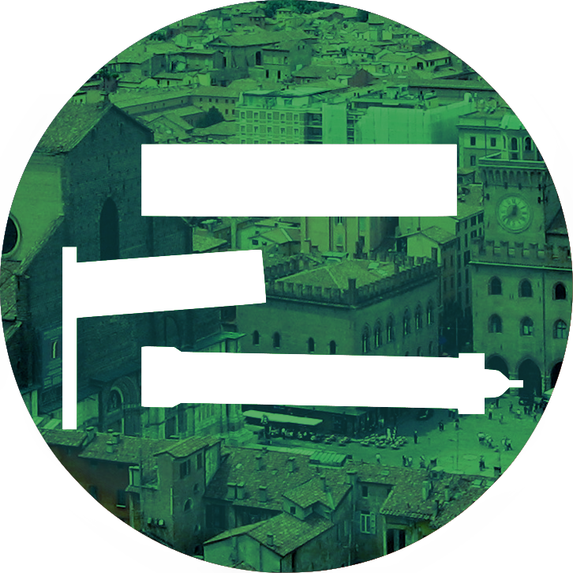

# Logo GFE Bologna
Un nuovo logo per la Gioventù Federalista Europea di Bologna in quattro versioni (dal più vicino al più distante a quello della GFE originale):

Il più minimalista: verde classico, variazione sul tema.

Gradiente verde-nero:

Città bruciata sullo sfondo verde:

Città in trasparenza coi colori bolognesi:

